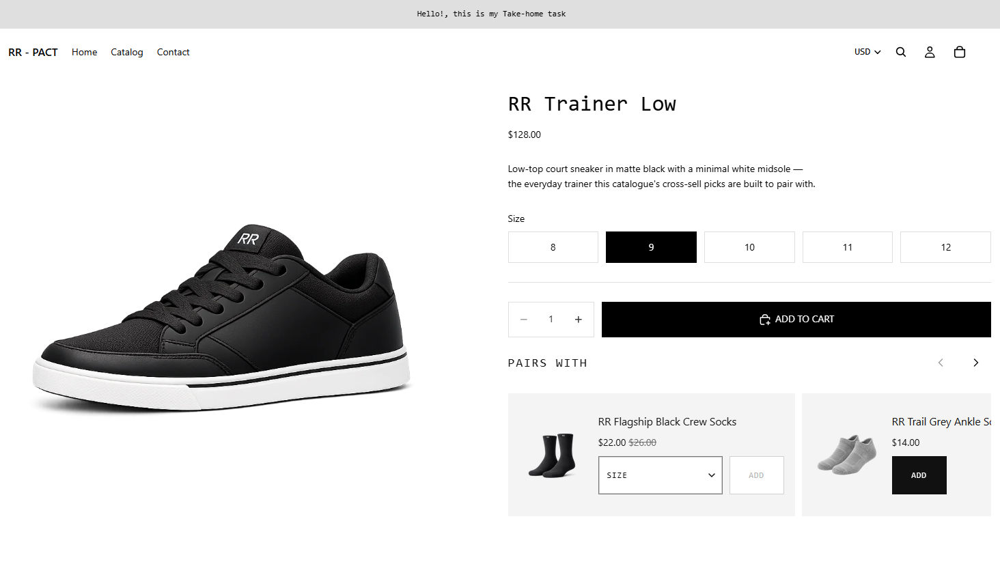
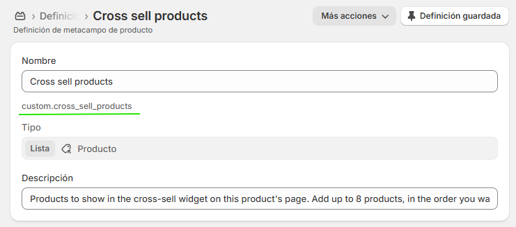
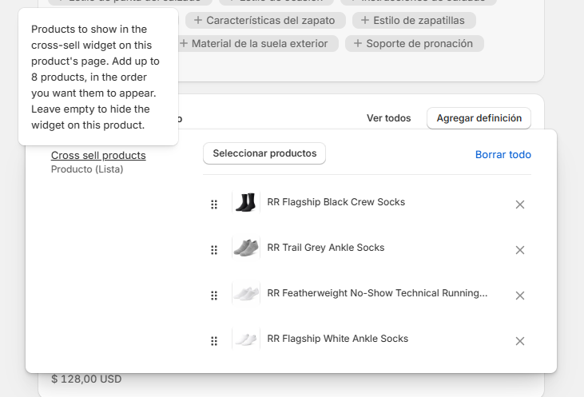
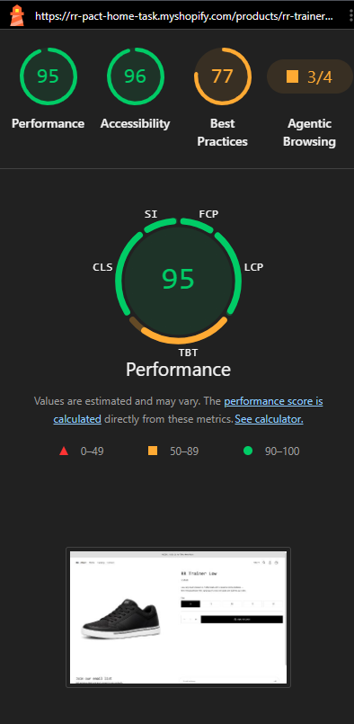
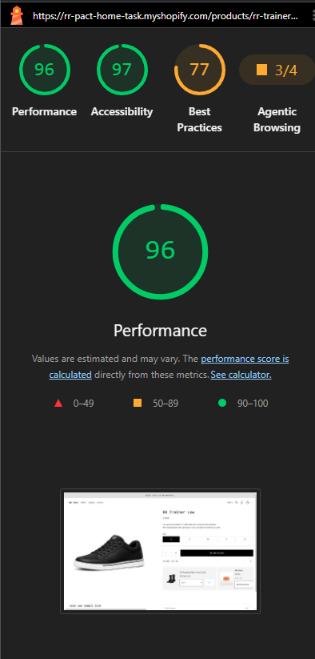

# "Pairs With" — a custom cross-sell widget for the product page

A theme-native replacement for a paid cross-sell app, built for the Pact Studio technical task.

The client's app was slowing the product page down and recommending inconsistently. This does the same job as part of the theme: the store team picks the companion products by hand, the cards are rendered on the server with the rest of the page, and shoppers add to cart without leaving the product they're on.

**Built on** Horizon 4.1.3 · **Zero base theme files modified** · **No third-party scripts, no runtime product fetch**



---

## The four requirements

| # | Requirement | How it's met |
|---|---|---|
| **R1** | The store team picks the cross-sell products manually, per product | A product metafield, `custom.cross_sell_products` (`list.product_reference`). The merchant works inside the Admin product page — no app, no separate dashboard. [Setup ↓](#1-create-the-metafield-definition) |
| **R2** | The widget renders directly below the Add to Cart button | A public theme block placed as the next sibling of `buy-buttons` in the product template. Positioned from the theme editor, with no base file touched. [Why that's possible ↓](#placement) |
| **R3** | Shoppers can add to cart from inside the widget | Each card renders the theme's own `<product-form-component>` — the same wiring `snippets/quick-add.liquid` uses. One round trip, drawer opens, no page reload. [Details ↓](#add-to-cart) |
| **R4** | The output matches the reference design | Monochrome, zero border radius, monospace UI type, horizontal cards, ~1.5 visible. Verified side-by-side against the reference at 1440px. [Design ↓](#design) |

---

## Demo

| | |
|---|---|
| **Storefront** | `<LIVE PREVIEW URL>` — password `<STOREFRONT PASSWORD>` |
| **Test product** | **RR Trainer Low** — 7 companions assigned, including a single-variant product, one with a sold-out size, and one with a two-line title |
| **Backup** | `<LOOM / BACKUP LINK>` in case the preview expires |

Products with nothing assigned render nothing at all — no empty container. Try any other product to see that.

---

## Screenshots

**The metafield definition** — created once, in Settings → Custom data → Products.



**Assigning products** — what the store team sees on a product page. Drag to reorder; that's the order shoppers get.



---

## Setup

### 1. Create the metafield definition

Settings → **Custom data** → **Products** → *Add definition*

| Field | Value |
|---|---|
| Name | `Cross sell products` |
| Namespace and key | `custom.cross_sell_products` |
| Type | **Product** → *List of products* |
| Limit | 8 |
| Description | *Products to show in the cross-sell widget on this product's page. Add up to 8 products, in the order you want them to appear. Leave empty to hide the widget on this product.* |

The description matters more than it looks — it's the only instruction the store team gets, so it's written for them, not for a developer.

### 2. Assign products

Open any product → scroll to **Cross sell products** → *Select products* → drag to order → **Save**.

That's the entire merchant workflow. Leave it empty and the widget disappears from that product.

### 3. Place the block

Theme editor → **Product** template → inside the product details group, add the **Cross-sell** block directly after **Buy buttons**.

The repo already ships `templates/product.json` with the block positioned there, so on this store it's done. The step is listed for anyone installing into a different theme.

### 4. Adjust the settings

| Setting | Type | Default | Notes |
|---|---|---|---|
| `heading` | text | `Pairs with` | Shown above the carousel |
| `products_per_view` | range 1–2, step 0.1 | `1.3` | How many cards fit in the viewport. The fractional value is what creates the cut-off next card |
| `show_price` | checkbox | `true` | Hides the price line when off |
| `max_products` | range 2–8 | `8` | Caps how many of the assigned products render |

`products_per_view` uses a step of `0.1` rather than `0.25` because `theme-check` rejects range steps that aren't multiples of `0.1`.

---

## Running it locally

No `package.json`, no build step, no bundler — theme files are served exactly as authored.

```bash
shopify theme dev   --store rr-pact-home-task.myshopify.com --theme 158575362200   # preview + hot reload
shopify theme check                                                                # linter — 348 files, 0 offenses
shopify theme push  --store rr-pact-home-task.myshopify.com --theme 158575362200   # upload
```

---

## How it's built

### Files

Everything hand-written for this task carries an `rr-` prefix, so `git diff` against the baseline shows the work at a glance.

| Path | Role |
|---|---|
| `blocks/rr-cross-sell.liquid` | The public theme block: schema, heading, arrows, carousel container |
| `snippets/rr-cross-sell-card.liquid` | One card |
| `assets/rr-cross-sell.js` | The `<cross-sell-component>` custom element |
| `assets/rr-cross-sell.css` | Block-scoped styles |
| `locales/en.default.schema.json` | 5 new theme-editor labels, translated across all 20 locale files |
| `templates/product.json` | Merchant configuration — positions the block. Written by the theme editor, not by hand |

**No Horizon source file is modified.** The only edits to pre-existing files are additive keys in the schema locale, plus `templates/product.json`, which is configuration rather than theme code. Commit `836d585` is the untouched base theme:

```bash
git diff 836d585..HEAD --stat
```

That claim isn't cosmetic — it's what makes the widget survive a theme update. Nothing here has to be re-applied or merged when Horizon ships a new version.

### Placement

Horizon has no `main-product.liquid`. The product page is `sections/product-information.liquid`, which renders `` and accepts `@theme` in its schema — so any public theme block can be dropped anywhere in the product column from the editor. Sitting directly below Add to Cart is therefore a *placement*, not a code change.

The block sets `"tag": null` in its schema. Without it, Shopify wraps the output in a generated `<div>` that stays in the DOM even when the block prints nothing — which is exactly the empty container that must never appear on a product with no companions.

### Rendering

Cards are server-rendered in Liquid. There is no client-side product fetch and no Storefront API call — everything a card needs is already available when Liquid runs.

The assignment is read through `closest.product`, never the global `product`, because a block can be placed in contexts where the two differ.

Each companion resolves to one of four modes at render time:

| Mode | Condition | Behaviour |
|---|---|---|
| `none` | Single variant | No selector; ADD enabled immediately |
| `option` | Exactly 1 option | A `<select>` of that option's values |
| `variant` | 2 options, ≤12 variants | A `<select>` of variants, labelled with `variant.title` |
| `link` | 3+ options, >12 variants, or selling plans | No form — a "Choose" link to the product page |

The cut-off is deliberate: one control fits inside a ~294px card without crowding the ADD button; two don't. Falling back to a link past that point mirrors the same trade-off the theme itself makes in `snippets/quick-add.liquid`.

### Add to cart

Cards don't post to the cart themselves. Each renders the theme's own `<product-form-component>`, following the pattern in `snippets/quick-add.liquid`. That means the optimistic cart event, the 422 handling, the live region, the loading state and the drawer's auto-open all come from `assets/product-form.js` — none of it is reimplemented, and there is no second cart-sync path to keep in step.

Every line item added from the widget carries `properties[_source] = pdp-cross-sell`, so the revenue it drives can actually be measured instead of estimated.

**One structural decision worth calling out.** Each card's root is a `<product-card data-no-navigation>` rather than a plain `<div>`. In `assets/product-form.js`, every `<product-form-component>` subscribes to the `productSelect` event on its nearest `.shopify-section, dialog, product-card`, and `#getVariantPicker()` walks up to that same container and returns its only `variant-picker` without checking which product it belongs to. Without a `product-card` boundary, a shopper who changes the main product's size and then presses ADD on a cross-sell card in the same moment would add the *main* product's variant — and the batch path posts a bare JSON body with no `properties`, so `_source` would vanish too. Wrapping each card makes `closest(...)` resolve to the card itself. It's the same `product-card > product-form-component` nesting the theme already uses on collection grids, and it's covered by a dedicated QA case.

### Carousel

CSS `scroll-snap` and `overflow-x: auto`. No carousel library. The arrows are progressive enhancement only — the scroller works with JavaScript disabled, and `assets/rr-cross-sell.js` does nothing but toggle the arrows' `aria-disabled` at each end and keep each card's `<select>` in sync with its hidden variant id. **It makes no fetch call and dispatches no cart event of its own.**

The controls row collapses to a stacked layout through a **container query**, not a media query, because the card also narrows when the merchant raises `products_per_view` — a viewport breakpoint can't see that.

### Design

Token values live in [docs/design-tokens.md](docs/design-tokens.md), the visual source of truth. The non-negotiables from the reference: zero border radius everywhere, monochrome, the theme's heading face for UI text and body face for content text, and the 2px active border implemented as an inset `box-shadow` so focusing the select never shifts the layout by a pixel.

Type families resolve from the theme's own `--font-heading--family` / `--font-body--family` rather than a widget-owned font stack, so the widget follows the store's typography instead of fighting it.

---

## Performance

The honest framing first: this wasn't benchmarked against the specific app being replaced, because that app isn't installed here. So there is no before-and-after against the incumbent. What there is: a measured comparison against the same page without the widget, and an architectural argument for why the difference is what it is.

### Measured

Same product page, same published store, block removed and re-added between runs.

| | Without the widget | With the widget |
|---|---|---|
| **Performance** | 95 | **96** |
| **Accessibility** | 96 | **97** |
| **Best Practices** | 77 | **77** |

|  |  |
|---|---|
|  |  |
| *Without the widget* | *With the widget* |

**The widget lands inside run-to-run variance of the clean theme — both score in the green.** I'm not claiming it makes the page faster; a one-point delta on a single run is noise. The claim is that adding seven server-rendered product cards, a stylesheet and a script costs nothing measurable, which is exactly what should happen and is not what the page was doing with an app in that slot.

Best Practices sits at 77 on both runs — that's Horizon's baseline, unchanged by this widget.

### Why it comes out that way

- **No external requests.** No third-party script, no CDN dependency, no vendor endpoint.
- **No runtime product fetch.** A typical cross-sell app asks the server what to recommend *after* the page loads, so the widget appears post-hydration and can shift layout. These cards are in the HTML of the first response.
- **Two static assets**, both served from the theme: one CSS file, one ES module. No framework, no bundler.
- **Images** carry explicit `width`/`height`, `srcset` at 1x/2x and `loading="lazy"` — reserved space, no layout shift.

One number that isn't where I'd like it: `assets/rr-cross-sell.js` is ~8.4 KB raw, above the ~3 KB budget I set myself. Most of that is inline comments explaining the decisions above, and it hasn't been measured minified or gzipped.

---

## Accessibility and i18n

Keyboard-operable end to end: labelled selector, `aria-label` on the arrows, `aria-disabled` (not `disabled`) when an arrow is at an end so it stays focusable, visible focus rings throughout, and an `aria-live` region announcing each add. Motion is limited to colour and shadow transitions, wrapped in `prefers-reduced-motion`.

Every visible string resolves through `| t`. The widget needed **no new storefront strings** — it reuses keys the theme already ships (`actions.add`, `actions.added`, `content.unavailable`, and others). The only additions are 5 theme-editor labels, translated across all 20 locale files.

Lighthouse's accessibility audit scores the page 97 with the widget and 96 without it — adding this much interactive UI costs nothing there.

One stated decision rather than an oversight: the disabled ADD label sits around 2:1 contrast, matching the reference. Disabled controls are exempt from WCAG 1.4.3, so it's defensible — but it was a choice.

---

## Testing

`shopify theme check` runs clean: 348 files, 0 offenses.

The manual QA pass is documented as evidence, not as a formality — what was checked, how, and what wasn't. Full matrix in **[docs/plans/02-qa-checklist.md](docs/plans/02-qa-checklist.md)**: blocking behaviour including the isolation case above, functional states, visual comparison against the reference, keyboard and reduced motion, five responsive viewports, JS disabled, cross-browser and Lighthouse.

Every section was run and nothing failed, including all four branches of the variant decision tree. Two cases stay open — a screen-reader pass and a forced cart error — both blocked by the test environment rather than by a defect, both concerning behaviour inherited from the theme rather than code written here, and both named in the checklist with their reason.

---

## Trade-offs

**What I deliberately didn't build:**

- **No algorithmic recommendations.** The brief asks for manual curation, and an automatic fallback would have meant depending on Shopify's Search & Discovery app — quietly reintroducing the app dependency the client is trying to drop.
- **No carousel library.** Scroll-snap does it in CSS.
- **No second cart pipeline.** Reusing the theme's own form component means one code path to maintain, and the widget inherits every cart fix Horizon ships.
- **No empty state on the storefront.** A product with nothing assigned renders zero DOM. The one exception is the theme editor, where a minimal placeholder has to exist or the block can't be selected and dragged.

**What I'd do next, with more time:**

- Turn the `_source` line-item property into a simple revenue report, so the client can see what the widget earns per product instead of assuming.
- A bulk assignment view. One product at a time is right for the best sellers, slow across a full catalogue.
- Measure against the outgoing app directly, on the client's own store, for a real before-and-after rather than an architectural argument.

---

## Documentation

| Doc | What's in it |
|---|---|
| [docs/features/cross-sell-widget.md](docs/features/cross-sell-widget.md) | Feature documentation — a plain-language overview first, then the technical reference |
| [docs/plans/cross-sell-widget.md](docs/plans/cross-sell-widget.md) | The implementation plan and the reasoning behind each architectural decision |
| [docs/plans/02-qa-checklist.md](docs/plans/02-qa-checklist.md) | The QA matrix |
| [docs/design-tokens.md](docs/design-tokens.md) | Visual source of truth — every token, with the arithmetic behind it |
