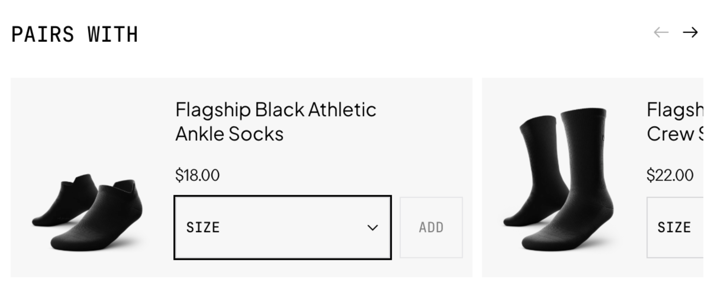

# Design Tokens & Styling Spec — "Pairs With" Widget



Derived from the reference screenshot and measured against the live theme. Everything below is a **read of the comp**, not a handoff from a design file — see *Method & confidence* for how the absolute values were derived.

---

## 1 · What the reference actually communicates

The design has a clear, deliberate visual system. Naming it matters more than matching any single pixel:

1. **Dual-typeface contrast.** A tracked-out **monospace** carries all *system/UI* text (section heading `PAIRS WITH`, the `SIZE` label, the `ADD` label). A neutral **grotesque** carries all *content* text (product name, price). This split is the single strongest source of the "premium editorial" feel. Preserve it above all else.
2. **Zero border radius.** Cards, selects and buttons all have hard 90° corners. Sharp geometry = considered, technical, fashion-adjacent.
3. **Monochrome only.** White page, light-grey card surface, near-black ink, one mid-grey for disabled. No accent colour anywhere. Emphasis is created with *weight and border*, never with hue.
4. **Border weight as state.** The first card's select has a **2px black** border; the second card's is a **1px light grey**. That's a resting vs. focused/active state, not a decoration. The `ADD` button is rendered in grey = **disabled until an option is chosen**.
5. **Deliberate peek.** The next card is cut off mid-frame. That's the scroll affordance — the arrows alone aren't carrying it. Keep ~1.5 cards visible on desktop.
6. **Horizontal card layout.** Image on the left (~25% of card width), all content stacked on the right. Not the usual vertical product card — this keeps the widget short so it doesn't push the page down below the Add to Cart button.
7. **Product images sit directly on the card surface**, no inner container, no white tile. Requires transparent or matching-background product photography.

---

## 2 · Method & confidence

The screenshot is a **zoomed crop**, so its absolute pixels were never directly usable — that part of the original method holds. What kept moving is the reference width it got de-scaled against, and this is now the **second correction** to that number:

1. First pass: anchored a 56px select height, backed into a scale factor, and *guessed* a ~600px product-info column. Never derived from the screenshot.
2. Second pass: measured `snippets/product-information-content.liquid`'s media-left grid (`min(50vw, --sidebar-width)`) and landed on a 376px plateau. The math was correct, but it described a section layout the demo store isn't actually running.

**What the demo store actually runs**, confirmed in `templates/product.json:336-340`: `content_width: "content-full-width"`, `equal_columns: true`, `gap: 48`, `limit_details_width: false`. That combination activates a different branch of the same Liquid file (`snippets/product-information-content.liquid:62-63`) — the `product-information__grid--half` class, not the plain media-left grid the first correction measured.

**Measured, not assumed, this time:**

- `product-information__grid--half` (`snippets/product-information-content.liquid:218-225`) sets `grid-template-columns: var(--full-page-grid-margin) calc(var(--full-page-grid-central-column-width) / 2) calc(var(--full-page-grid-central-column-width) / 2) var(--full-page-grid-margin)` — the details column is **half of the section's central column**, not a sidebar with its own fixed ceiling.
- `--full-page-grid-central-column-width` (`assets/base.css:340-343`) resolves to `min(var(--page-width) - var(--page-margin) * 2, calc(100% - var(--page-margin) * 2))`. With `page_width: "narrow"` (`config/settings_data.json:46`) → `--page-width: 90rem` (1440px, `snippets/theme-styles-variables.liquid:133`), and `--page-margin: 40px` at ≥750px / `16px` below that (`assets/base.css:300-309`) — this resolves per viewport in the table below.
- `.product-details` still carries `padding-left: calc(var(--gap) / 2)` (`snippets/product-information-content.liquid:190`, unchanged by the `--half` variant); the template's `gap: 48` (`templates/product.json:340`) makes that a flat **24px** lost on every viewport.

| Viewport | Central column | Details column (half) | **Usable width** (− 24px padding) |
|---|---|---|---|
| 750px | 670px | 335px | **311px** |
| 990px | 910px | 455px | **431px** |
| 1200px | 1120px | 560px | **536px** |
| 1440px+ | 1360px (capped by `--page-width`) | 680px | **656px** |

The theme's own breakpoints for this section are **750px** and **1200px** (`snippets/product-information-content.liquid:155, 166, 297, 318`) — the token scale below (§4, §5) is aligned to those, not to the sidebar variant's old 990px cutoff.

**The material point for the write-up:** this width is not a fixed theme constant — it's a direct function of section settings the merchant controls (`content_width`, `equal_columns`). A different combination (media-left, unequal columns) would resolve to the §2-v1 sidebar numbers instead, and a store running `limit_details_width: true` would cap it differently again. That's exactly why the tokens below scale per breakpoint from real arithmetic rather than assuming one fixed column width: the column itself is merchant-configurable, so the widget's own responsive plan has to tolerate that — and the controls-row container query (§6) goes one step further still, because `products_per_view` narrows the same box independently of both the column width and the viewport.

The *proportions* read from the comp (image ÷ card, gap ÷ card, the type-scale ratios) are still the right source for the internal relationships — only the reference width kept needing correction. At this width the comp's proportions hold up closer to their literal reading than either previous pass predicted; the full arithmetic check is in §10.

---

## 3 · Colour tokens

Monochrome, five values, no accents.

| Token | Value | Use | Contrast |
|---|---|---|---|
| `--cs-bg` | `#FFFFFF` | Section / page background | — |
| `--cs-surface` | `#F4F4F4` | Card background | — |
| `--cs-surface-field` | `#FFFFFF` | Select & button background | — |
| `--cs-ink` | `#111111` | Headings, product name, price, active borders, active arrow | 16.5:1 on surface ✅ |
| `--cs-ink-muted` | `#6B6B6B` | Secondary copy, helper text | 5.3:1 on white ✅ |
| `--cs-ink-disabled` | `#B3B3B3` | Disabled `ADD` label | ~2.0:1 ⚠️ |
| `--cs-border` | `#D0D0D0` | Resting select / button border | ~1.5:1 (up from ~1.2:1) |
| `--cs-border-strong` | `#111111` | Focus / active border, 2px | — |
| `--cs-arrow-idle` | `#9E9E9E` | Disabled carousel arrow | — |

**One flag resolved into a stated decision, one left as-is:**

- `--cs-border` moves from `#E3E3E3` (~1.2:1 against white) to `#D0D0D0` (~1.5:1). That's a real step up, but read as an isolated stroke against the white field it still sits under the literal **WCAG 1.4.11** threshold (3:1 for a non-text UI boundary when the border is the only thing marking the control) — reaching that in full would need something close to `#767676` (~4.5:1), at real cost to the light aesthetic the reference specifies. The resting select in this spec is never delimited by the stroke alone, though: the white field sits on the grey `--cs-surface` card (§6, *Select*), so the boundary is also carried by a surface-colour change, and the state that actually needs to be unmistakable — the 2px `--cs-border-strong` focus/active border — already clears contrast by a wide margin. This is now a settled, documented trade-off rather than a question for the client.
- `--cs-ink-disabled` at ~2:1 stays a stated decision, not an oversight: disabled controls are exempt from WCAG 1.4.3, so reproducing the comp's low-contrast disabled label is defensible.

---

## 4 · Typography

### Families

The exact fonts can't be identified from a raster crop; these are matched by classification and metrics.

| Role | Classification | Reference-likely | Free/web-safe stack |
|---|---|---|---|
| **UI / system** | Grotesque **monospace**, uppercase, wide tracking | ABC Diatype Mono, Söhne Mono, Martian Mono | `ui-monospace, "SF Mono", "Roboto Mono", "IBM Plex Mono", Menlo, monospace` |
| **Content** | Neutral geometric grotesque — double-storey `a`, single-storey `g`, tall x-height, flagged `1` | Aeonik, Neue Montreal, Söhne, Helvetica Now | `"Inter", -apple-system, BlinkMacSystemFont, "Segoe UI", Helvetica, Arial, sans-serif` |

For the prototype, prefer the **theme's existing font settings** for the content face (`{{ settings.type_body_font }}`) so the widget inherits the client's brand, and add only the monospace as a variable. That's one fewer font file loaded and one fewer thing to license.

### Scale

Sized per breakpoint, not once, because the column itself is (§2). The `750–1199px` values also apply below 750px — the type scale doesn't step down a third time, only the geometry tokens in §5 do.

| Token | ≥1200px | 750–1199px (and below) | Weight | Tracking | Case | Applied to |
|---|---|---|---|---|---|---|
| `--cs-fs-heading` | `18px` (`1.125rem`) | `16px` (`1rem`) | 500 | `0.10em` | UPPER | `PAIRS WITH` (mono) |
| `--cs-fs-title` | `16px` (`1rem`) / lh 1.30 | `15px` (`0.9375rem`) | 400 | `-0.01em` | Sentence | Product name (grotesque) |
| `--cs-fs-price` | `14px` (`0.875rem`) / lh 1.2 | `13px` (`0.8125rem`) | 400 | `0` | — | Price (grotesque) |
| `--cs-fs-label` | `12px` (`0.75rem`) | `11px` (`0.6875rem`) | 500 | `0.08em` | UPPER | `SIZE`, `ADD` (mono) |

Product titles clamp to **2 lines** (`-webkit-line-clamp: 2`) so card heights never diverge.

---

## 5 · Spacing & geometry

Three tiers, aligned to the theme's own **750px / 1200px** breakpoints (§2), not the sidebar variant's old 990px cutoff. A blank cell means the value carries over from the tier to its left — most tokens only step down once or twice across the whole range.

| Token | ≥1200px | 750–1199px | <750px | Use |
|---|---|---|---|---|
| `--cs-radius` | `0` | | | Everything. No exceptions. |
| `--cs-per-view` | `1.3` (schema default; merchant-configurable 1–2) | | | Cards visible per viewport; drives `--cs-card-w` |
| `--cs-gap-card` | `10px` | | | Between carousel cards, all breakpoints |
| `--cs-pad-card` | `16px` | `12px` | | Card inner padding |
| `--cs-gap-media` | `16px` | `12px` | `10px` | Image column → content column |
| `--cs-gap-stack` | `12px` | `8px` | | Title → price → controls |
| `--cs-gap-controls` | `10px` | | | Select → ADD, all breakpoints |
| `--cs-space-header` | `32px` | `24px` | | Section heading → carousel |
| `--cs-control-h` | `56px` | `48px` | | Select and ADD height — exceeds the theme's `--minimum-touch-target: 44px` (`theme-styles-variables.liquid:637`) at every tier |
| `--cs-media-w` | `100px` | `84px` | `76px` | Image column width |
| `--cs-add-min-w` | `80px` | `72px` | | Minimum width reserved for the ADD button inside the content column |
| `--cs-card-w` | `clamp(300px, calc((100% - var(--cs-gap-card)) / var(--cs-per-view)), 420px)` | `clamp(248px, …, 400px)` | `clamp(240px, …, 340px)` | Card width; resolves to the visible-cards ratio (§2, §10) |
| `--cs-border-w` | `1px` | | | Resting border |
| `--cs-border-w-strong` | `2px` | | | Focus / active border |

**Critical:** the 2px active border must not shift layout. Use `box-shadow: inset 0 0 0 2px` or a transparent 2px resting border, never a border-width change.

**Below the token scale, a container query** (§6) handles the one width the breakpoint tiers above can't: when a single card's own content column gets too narrow for `[select | ADD]` — whether from a small viewport or from the merchant raising `products_per_view` — the controls row switches from horizontal to stacked, independent of which of the three tiers above is active.

---

## 6 · Component specs

### Overflow containment — non-negotiable

Every level between the block root and the scroll-snap track needs `min-width: 0`: the block wrapper, the `<cross-sell-component>` host, the scroller (the element carrying `overflow-x`), and each card's content column. Any CSS grid placing these needs `minmax(0, 1fr)` instead of a bare `1fr` for the same reason. Skip it anywhere in that chain and a flex/grid item falls back to its `min-content`; for an `overflow-x` scroller, `min-content` is the width of its widest unbroken child, which forces the whole thing wider than its track — and since that track sits inside the PDP's own grid (`snippets/product-information-content.liquid`), the failure mode is the product-info column itself getting wider, not a harmless internal scrollbar.

### Section header
Mono, uppercase, tracked, `--cs-ink`, left-aligned. Arrows pinned right on the same baseline row.

### Carousel arrows
- Icon: thin-stroke arrow, `stroke-width: 1.5`, `20px` box, `currentColor`.
- Hit area: **44 × 44px** minimum (touch target), transparent background, no border, no circle.
- Gap between the two: `8px`.
- States: enabled `--cs-ink` · disabled `--cs-arrow-idle` + `pointer-events: none` + `aria-disabled="true"`.
- Hidden below 750px — swipe carries it there.

### Card
`--cs-surface`, radius 0, no border, no shadow. CSS grid: `grid-template-columns: var(--cs-media-w) minmax(0, 1fr)`, items centred vertically.

### Product image
`aspect-ratio: 1 / 1`, `object-fit: contain`, sits on the card surface with no wrapper background. `loading="lazy"`, `srcset` at 1x/2x of the rendered size, explicit `width`/`height` to prevent CLS.

### Select
White field on the grey card, 1px `--cs-border`, `--cs-control-h`, mono uppercase label, custom chevron (16px, inline SVG as `background-image`, `appearance: none`), padding `0 40px 0 16px`.

### ADD button
`--cs-control-h`, `min-width: var(--cs-add-min-w)`, `padding: 0 16px`, mono uppercase label, radius 0. Two label spans (`ADD` / `ADDED`) share one grid cell (`grid-area: 1 / 1`) so the track sizes to the wider of the two — see §7 for the success-state swap.

### Controls row — container query

`.cross-sell-card__body` is the query container (`container-type: inline-size`, `container-name: cross-sell-card`), not `.cross-sell-card` itself and not a viewport media query. `snippets/resource-list-carousel.liquid:57-89` establishes the same kind of container for the same reason and is the precedent this follows.

The width that decides whether `[SELECT | ADD]` still fits is this box's own inline size, and two independent things can shrink it: the viewport (§5), and the merchant raising `products_per_view` up to the schema's max of `2` — the latter a media query can never see, because a card can be narrow at a wide viewport just as easily as at a narrow one.

Below **200px** of container width, `.cross-sell-card__controls` switches from a row (the default) to a column: select on top at full width, `ADD` full-width beneath it. 200px is derived, not picked:

```
legible select floor   ≈ 110px
+ --cs-gap-controls      10px  (constant at every breakpoint)
+ --cs-add-min-w          80px  (the widest value in the scale, the ≥1200px tier)
= 200px
```

Using one fixed threshold across all three breakpoint tiers is deliberately conservative rather than exact: at the 750–1199px and <750px tiers `--cs-add-min-w` drops to `72px`, so the same 200px floor actually leaves the select `118px` there — a small safety margin, not a tight fit. §10 walks through the 311px-column dead zone (750px viewport) where this query is the difference between a 46px, illegible select and a full-width, stacked one.

---

## 7 · Interaction states

The comp shows two of these; the rest are inferred and should be listed as assumptions in the write-up.

| Element | State | Spec |
|---|---|---|
| Select | resting | bg `#FFF`, 1px `--cs-border`, label `--cs-ink` |
| Select | hover | border → `--cs-ink` at 1px |
| Select | focus / active | **2px `--cs-ink`** *(shown in the comp, card 1)* |
| Select | focus-visible (kbd) | 2px `--cs-ink` + `outline: 2px solid --cs-ink; outline-offset: 2px` |
| ADD | disabled *(default)* | bg `#FFF`, 1px `--cs-border`, label `--cs-ink-disabled`, `cursor: not-allowed` *(shown in the comp)* |
| ADD | enabled | **bg `--cs-ink`, label `#FFF`, border `--cs-ink`** — *inferred, confirm with client* |
| ADD | hover (enabled) | bg `#000`, subtle `transform: translateY(-1px)` or none |
| ADD | loading | label swaps to a 14px monochrome spinner, width locked, `aria-busy="true"` |
| ADD | success | label → `ADDED` for **800ms**, then back to `ADD` |
| ADD | error | label → `TRY AGAIN`, inline message below the card |
| Card | hover | no change — the design is static; restraint is the aesthetic |

The **enabled** ADD state is the one meaningful gap in the comp. Inverting to solid black is the reading most consistent with the rest of the system (black is already the "active" signal on the select border).

**Success state, implemented (`snippets/cross-sell-card.liquid`, `blocks/cross-sell.liquid`):** the 800ms duration is not this widget's choice — it's the theme's. `assets/product-form.js` sets `data-added="true"` on the button after a successful add and clears it again 800ms later (`assets/product-form.js:143-160`); this widget only reacts to that attribute, it never sets its own timer. `[data-added='true']` toggles which of the two grid-stacked label spans (§6) is visible via `visibility`/`opacity`, never `display`, so the button's width never jumps mid-animation.

This also closes a small gap in Horizon itself: `assets/product-form.js:533` looks for a `.add-to-cart-text--added` element on the clicked button to source the live-region announcement text, and no stock Horizon snippet ever emits that class — every add-to-cart button in the base theme silently falls back to the generic `Theme.translations.added`. This widget's `ADDED` label carries that exact class, so its announcement reads the real localized string instead of the fallback.

---

## 8 · Motion

| Token | Value |
|---|---|
| `--cs-dur` | `160ms` (state changes) |
| `--cs-dur-slow` | `320ms` (carousel scroll) |
| `--cs-ease` | `cubic-bezier(0.4, 0, 0.2, 1)` |

Transition `color`, `background-color`, `box-shadow` only — never `width`, `height` or `border-width`. Carousel uses `scroll-behavior: smooth` + `scroll-snap-type: x mandatory`. Wrap everything in `@media (prefers-reduced-motion: reduce) { transition: none; scroll-behavior: auto; }`.

---

## 9 · Responsive behaviour

| Breakpoint | Behaviour |
|---|---|
| **≥1200px** | Column at **536–656px** usable (`product-information__grid--half`, §2); `--cs-card-w` resolves to **~380–420px**, ~1.3–1.5 cards visible + peek, arrows shown. Full tokens in §5. |
| **750–1199px** | Column at **311–536px** usable; type scale, control height and spacing step down a tier (§4, §5). At the narrow end of this range the clamp floor (`248px`) engages, and a card's own `.cross-sell-card__body` can drop under the controls-row container-query threshold (§6) — that switch is viewport-independent, driven by the card's rendered width, not the 750/1200 breakpoints themselves. |
| **<750px** | `--cs-card-w: clamp(240px, calc((100% - var(--cs-gap-card)) / var(--cs-per-view)), 340px)`, `--cs-media-w: 76px`, `--cs-gap-media: 10px` (control height, ADD floor and card padding carry over from the 750–1199px tier), arrows hidden — swipe only. Card stays horizontal; see rationale below. |

Keep the horizontal card layout on mobile. Flipping to a stacked card doubles the widget's height right under the Add to Cart button, which is the worst possible place to add scroll depth on the highest-converting device.

---

## 10 · Paste-ready token block

```css
.cross-sell {
  /* Colour */
  --cs-bg:              #ffffff;
  --cs-surface:         #f4f4f4;
  --cs-surface-field:   #ffffff;
  --cs-ink:             #111111;
  --cs-ink-muted:       #6b6b6b;
  --cs-ink-disabled:    #b3b3b3;
  --cs-border:          #d0d0d0;
  --cs-border-strong:   #111111;
  --cs-arrow-idle:      #9e9e9e;

  /* Type — ≥1200px tier (536–656px column, §2) */
  --cs-font-mono:  ui-monospace, "SF Mono", "Roboto Mono", "IBM Plex Mono", Menlo, monospace;
  --cs-font-body:  var(--font-body--family, "Inter", -apple-system, "Segoe UI", Helvetica, Arial, sans-serif);
  --cs-fs-heading: 18px; /* 1.125rem */
  --cs-fs-title:   16px; /* 1rem */
  --cs-fs-price:   14px; /* 0.875rem */
  --cs-fs-label:   12px; /* 0.75rem */
  --cs-track-wide: 0.10em;
  --cs-track-label:0.08em;

  /* Space & geometry — ≥1200px tier */
  --cs-radius:         0;
  --cs-per-view:       1.3;
  --cs-card-w:         clamp(300px, calc((100% - var(--cs-gap-card)) / var(--cs-per-view)), 420px);
  --cs-media-w:        100px;
  --cs-control-h:      56px;
  --cs-add-min-w:      80px;
  --cs-gap-card:       10px;
  --cs-pad-card:       16px;
  --cs-gap-media:      16px;
  --cs-gap-stack:      12px;
  --cs-gap-controls:   10px;
  --cs-space-header:   32px;
  --cs-border-w:       1px;
  --cs-border-w-strong:2px;

  /* Motion */
  --cs-dur:      160ms;
  --cs-dur-slow: 320ms;
  --cs-ease:     cubic-bezier(0.4, 0, 0.2, 1);
}

/*
  Arithmetic check, 656px column (the ≥1440px plateau, §2, --cs-per-view: 1.3):
  card     = min(420, (656 − 10) / 1.3 ≈ 497)  = 420px  (clamp cap engages)
  interior = 420 − (2 × 16 padding)              = 388px
  content  = 388 − 100 media − 16 gap-media      = 272px
  select   = 272 − 10 gap-controls − 80 ADD      = 182px
  → close to the comp's own select ÷ card proportion (the comp read ~190px), plus a visible peek
    of the next card: 656 / (420 + 10) ≈ 1.53 cards laid out.
*/

@media screen and (max-width: 1199px) {
  .cross-sell {
    --cs-fs-heading: 16px; /* 1rem */
    --cs-fs-title:   15px; /* 0.9375rem */
    --cs-fs-price:   13px; /* 0.8125rem */
    --cs-fs-label:   11px; /* 0.6875rem */
    --cs-card-w:     clamp(248px, calc((100% - var(--cs-gap-card)) / var(--cs-per-view)), 400px);
    --cs-media-w:    84px;
    --cs-control-h:  48px;
    --cs-add-min-w:  72px;
    --cs-pad-card:   12px;
    --cs-gap-media:  12px;
    --cs-gap-stack:  8px;
    --cs-space-header: 24px;
  }
}

/*
  Arithmetic check, 311px column (the 750px viewport floor — the controls-row dead zone, §6):
  card      = clamp(248, (311 − 10) / 1.3 ≈ 232, 400) = 248px  (clamp floor engages)
  interior  = 248 − (2 × 12 padding)                    = 224px
  container = 224 − 84 media − 12 gap-media             = 128px  ← .cross-sell-card__body's width
  A row layout here would give the select only 128 − 10 − 72 = 46px, illegible. 128px is below
  the container query's 200px threshold, so this card stacks instead: select and ADD both get
  the full 128px, well clear of the ~110px legible floor.
*/

@media screen and (max-width: 749px) {
  .cross-sell {
    --cs-card-w:    clamp(240px, calc((100% - var(--cs-gap-card)) / var(--cs-per-view)), 340px);
    --cs-media-w:   76px;
    --cs-gap-media: 10px;
  }
}

@media (prefers-reduced-motion: reduce) {
  .cross-sell { --cs-dur: 0ms; --cs-dur-slow: 0ms; }
}

/* Controls-row container query — derivation in §6. */
.cross-sell-card__body {
  container-type: inline-size;
  container-name: cross-sell-card;
}

@container cross-sell-card (max-width: 200px) {
  .cross-sell-card__controls {
    flex-direction: column;
    align-items: stretch;
  }
}
```

---

## 11 · Open questions for the client

Question 1 from the original read (column-width vs. full content width) is settled in the sense that matters for implementation: it's always column-width, never the full page width, whatever the section's settings. The *exact* pixel value, though, is not a theme constant — it's a direct function of merchant-controlled section settings (`content_width`, `equal_columns`; see §2, now on its second correction). That's precisely why §4 and §5 scale per breakpoint from real arithmetic instead of hard-coding one column width.

1. What is the **enabled** state of the `ADD` button? (Assumption: solid black fill, white label.)
2. Which **brand fonts** are licensed for web? The mono is doing a lot of work here — a generic fallback loses most of the character.
3. Product images appear on a transparent/matching background. Is the full cross-sell catalogue shot that way, or do we need a neutral tile fallback for inconsistent imagery?
4. Should the `SIZE` label be literal, or the product's real option name (Size / Colour / Length)? Building it dynamic is safer; the comp only shows one case.
